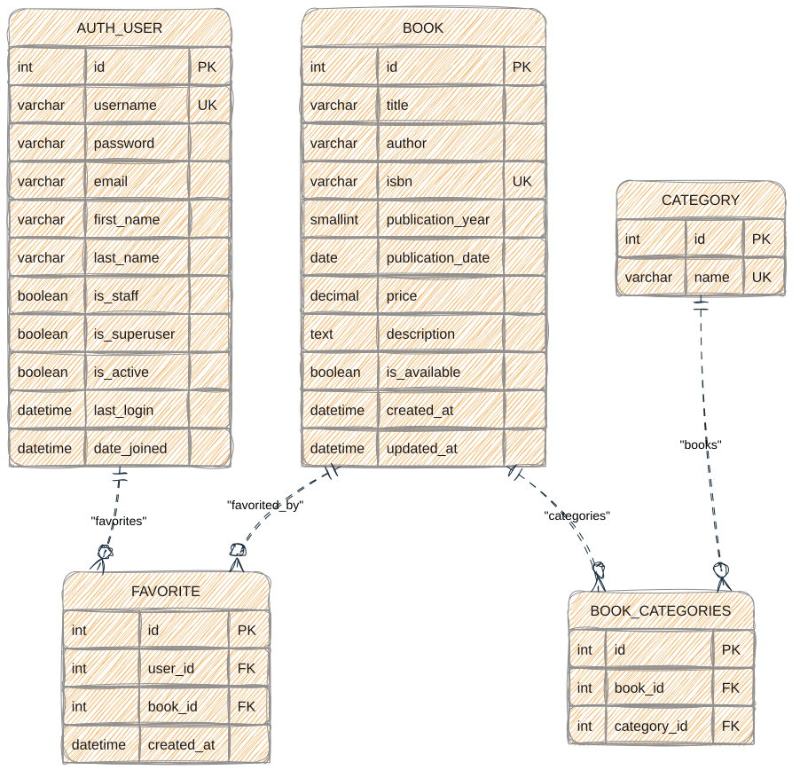

# Django Library Management

A Django web application for managing books, categories, authentication, and private user favorites.

Repository: `https://github.com/amirrezaparvaneh/django-library-management`

## Features

- Book CRUD: add, view, edit, and delete books.
- Search by title or author with case-insensitive partial matching.
- Filter by availability, category, price range, and publication-date range.
- Bulk-delete the books matching the current filters.
- Category management and a many-to-many relationship between books and categories.
- User registration, login, and POST-only logout.
- Private per-user favorites with duplicate protection.
- CSRF protection for mutating requests.
- Responsive styling served from `static/books/app.css`.

## Requirements

- Python 3.14+
- Django 6.0.8
- SQLite (the default development database)

## Setup

```bash
python3 -m venv .venv
source .venv/bin/activate
pip install -r requirements.txt
python manage.py migrate
python manage.py runserver
```

Run the automated test suite with:

```bash
python manage.py test
```

For production, configure `DJANGO_SECRET_KEY`, set `DJANGO_DEBUG=false`, and provide a comma-separated `DJANGO_ALLOWED_HOSTS` value.

## Main routes

| Route | Purpose |
| --- | --- |
| `/` or `/books/` | Book list, search, and filters |
| `/books/add/` | Add a book |
| `/books/<id>/` | Book details |
| `/books/<id>/edit/` | Edit a book |
| `/books/<id>/delete/` | Delete a book |
| `/books/delete-filtered/` | Bulk-delete filtered results |
| `/books/<id>/favorite/` | Toggle a favorite |
| `/favorites/` | Authenticated user's favorites |
| `/categories/` | List and create categories |
| `/signup/` | Register |
| `/login/` | Log in |
| `/logout/` | Log out via POST |

## Database design

The application uses Django's built-in `AUTH_USER` table plus the `books` app tables:

- `BOOK`: title, author, optional unique ISBN, publication year/date, non-negative optional price, description, availability, and timestamps.
- `CATEGORY`: unique category names.
- `FAVORITE`: links a user to a book; `(user_id, book_id)` is unique and both foreign keys cascade on deletion.
- `BOOK_CATEGORIES`: Django's auto-generated many-to-many table linking books and categories; `(book_id, category_id)` is unique.



The editable draw.io source is available at [`docs/library-er-diagram.drawio`](docs/library-er-diagram.drawio).
