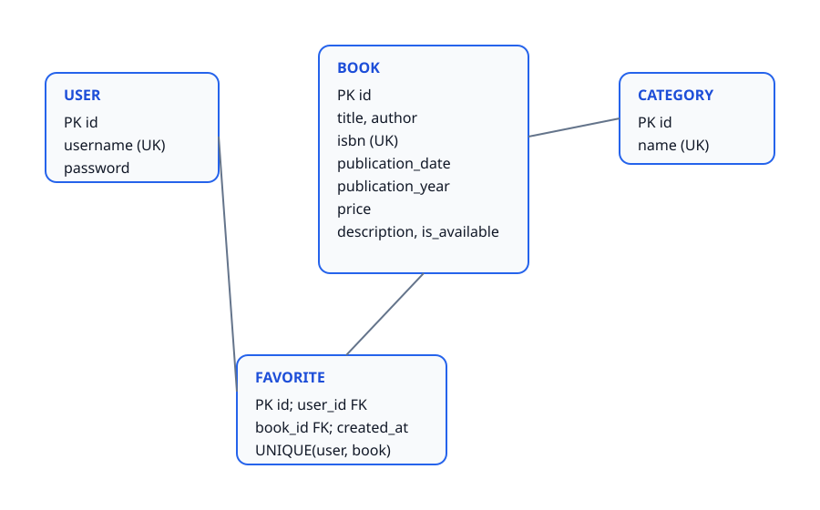

# Django Library Management

A library management web application built with Django.

## Project Status

Project setup and Git initialization completed.

## Database Design

The visual Entity-Relationship Diagram of the library management system:

