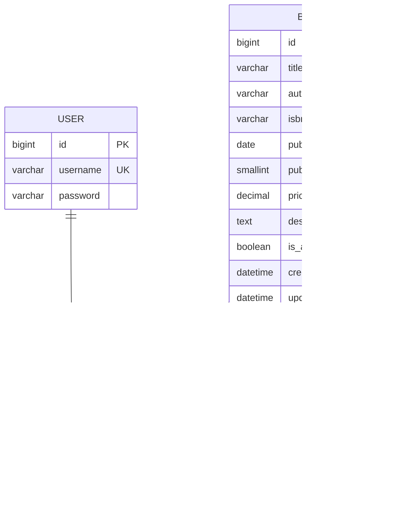

# Final ER Diagram

```mermaid
erDiagram
    USER ||--o{ FAVORITE : marks
    BOOK ||--o{ FAVORITE : receives
    BOOK }o--o{ CATEGORY : belongs_to
    USER { bigint id PK varchar username UK varchar password }
    BOOK { bigint id PK varchar title varchar author varchar isbn UK date publication_date smallint publication_year decimal price text description boolean is_available datetime created_at datetime updated_at }
    CATEGORY { bigint id PK varchar name UK }
    FAVORITE { bigint id PK bigint user_id FK bigint book_id FK datetime created_at }
```

`Favorite` has a unique constraint on `(user_id, book_id)`. `Book.categories` is a many-to-many relationship with `Category`.
